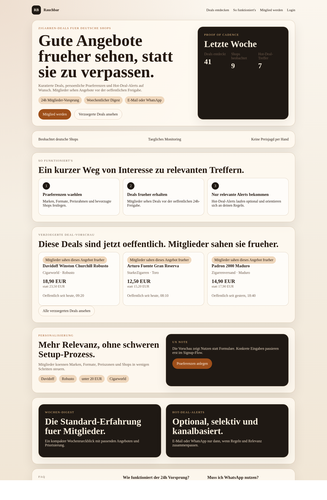
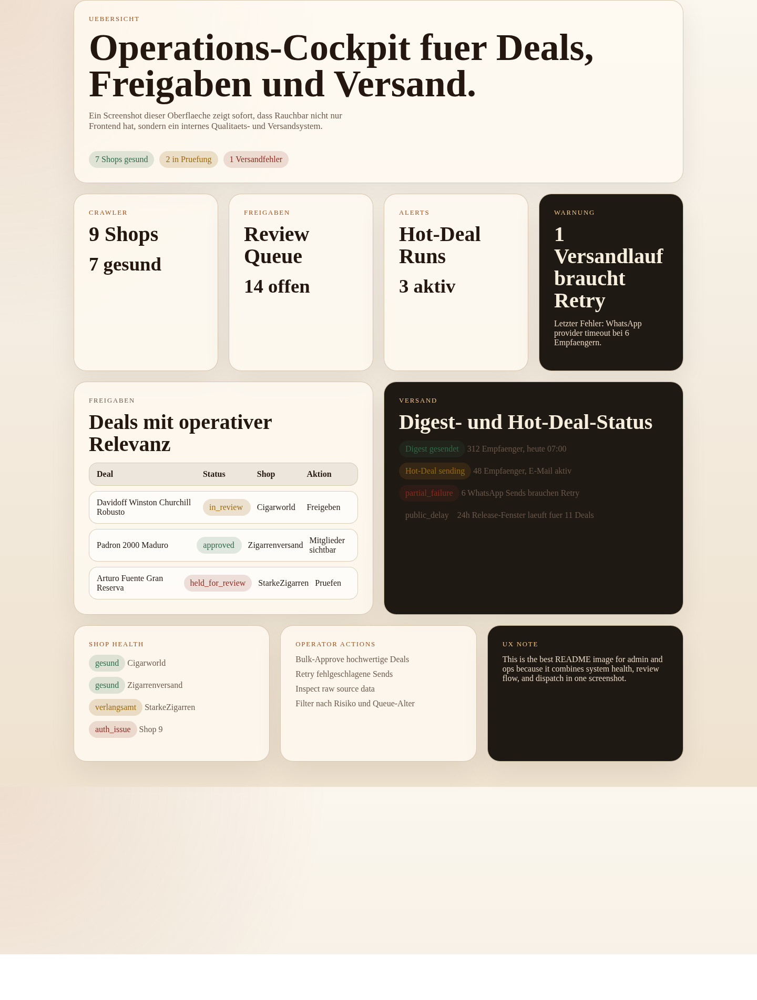
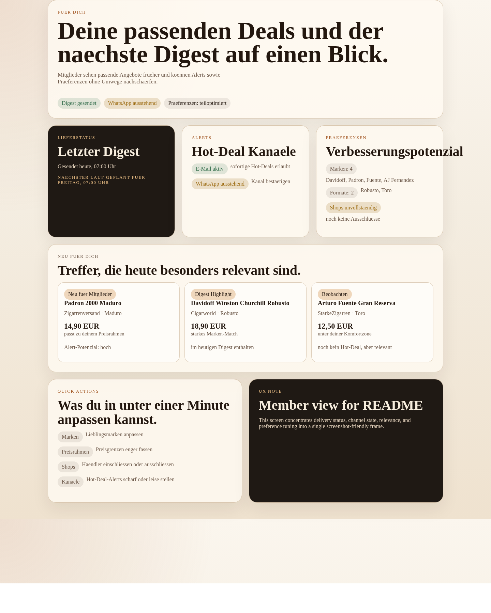
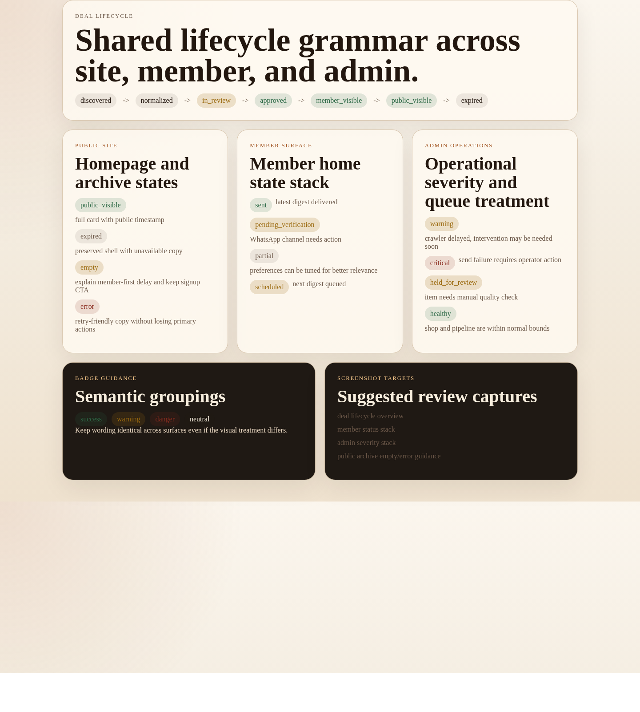

# Rauchbar

Rauchbar ist ein produktorientiertes Monorepo fuer einen kuratierten Deal-Service rund um Zigarrenangebote deutscher Online-Haendler. Das MVP kombiniert eine oeffentliche Site mit 24h Verzoegerung, einen mitgliederorientierten Signup- und Preference-Flow, eine interne Admin-Konsole fuer Freigaben und Versand, sowie Worker-Pipelines fuer Scraping, Matching und Benachrichtigungen.

## Produktversprechen

- kuratierter Wochen-Digest statt manueller Deal-Jagd
- optionale Hot-Deal-Alerts per E-Mail oder WhatsApp
- Mitglieder sehen relevante Angebote vor der oeffentlichen Freigabe
- klare Trennung zwischen interner Freigabe, Mitgliederfenster und oeffentlicher Publikation

## MVP im Ueberblick

Rauchbar fokussiert sich im ersten Schnitt auf drei Kernoberflaechen und gemeinsame Systembausteine:

- `apps/site`: Homepage, Signup, Preference-Onboarding, Mitgliedereinstieg und zeitverzoegertes Deal-Archiv
- `apps/admin`: Operations-Oberflaeche fuer Shops, Deals, Freigaben, Versand und Monitoring
- `apps/worker`: Scraping, Normalisierung, Hot-Deal-Erkennung, Digest-Erstellung und Versand-Jobs
- `packages/deals-core`: gemeinsame Domainmodelle und Regelgrundlagen
- `packages/design-system`: visuelle Sprache fuer Site, Admin und Mailings
- `packages/notifications`: Kanalabstraktionen fuer E-Mail und WhatsApp

## Produkt in Bildern

### Homepage und Mitgliederwert



Die Startseite erklaert das Produktversprechen, zeigt den 24h-Mitgliedervorsprung und macht den Signup-Einstieg sichtbar.

### Admin und Operations



Das Ops-Board verdichtet Merchant-Monitoring, Freigabe-Queue und Dispatch-Kontrolle in einer internen Arbeitsansicht.

### Personalisierte Mitgliedersurface



Die Mitgliedersurface zeigt, dass Rauchbar ueber eine Marketing-Seite hinausgeht und Digests, Alerts und Praeferenzpflege verbindet.

### Lifecycle und Statuslogik



Die Statusansicht macht die Trennung zwischen interner Freigabe, Mitgliederfenster und oeffentlicher Publikation nachvollziehbar.

Der Screenshot-Satz und die Reproduktionsschritte sind in [docs/ux/readme-screenshot-plan.md](docs/ux/readme-screenshot-plan.md) dokumentiert.

## Nutzer- und Surface-Modell

Das Produkt trennt klar zwischen drei Perspektiven:

- Oeffentliche Besucher verstehen das Angebot schnell, sehen verzoegerte Deals und werden in den Signup gefuehrt.
- Mitglieder erhalten relevante Digests, koennen Alerts steuern und ihre Praeferenzen leicht nachschaerfen.
- Admin-Operatoren pruefen Deals, ueberwachen Shop- und Versandstatus und greifen bei Fehlern gezielt ein.

Leitprinzipien fuer alle Oberflaechen:

- Relevanz vor Browsing-Tiefe
- Mitglieder-Vorteil an jeder passenden Stelle sichtbar machen
- Status, Versand und Freigaben immer explizit darstellen
- eine gemeinsame Designsprache fuer Site, Admin und Notifications nutzen

## Informationsarchitektur

Die aktuelle UX- und Design-Handoff definiert fuer das MVP unter anderem:

- Site-Navigation: `Deals entdecken`, `So funktioniert's`, `Mitglied werden`, `Login`
- Mitgliedsbereich: `Fuer dich`, `Alerts`, `Praeferenzen`, `Konto`
- Admin-Navigation: `Uebersicht`, `Shops`, `Deals`, `Freigaben`, `Versand`
- Homepage mit Hero, Cadence-Proof, "So funktioniert's", Delayed-Deal-Preview, Personalisierungsmodul, Digest/Alert-Erklaerung, FAQ und Final-CTA
- konsistente Lifecycle- und Statussprache fuer Deals, Mitglieder, Shop-Health und Versand

## Repository-Struktur

```text
apps/
  admin/        Interne Operations-Oberflaeche
  site/         Oeffentliche Site und Mitgliedersurface
  worker/       Datenpipeline, Matching und Versand
packages/
  deals-core/   Domainmodelle, Regeln, Normalisierung
  design-system/ Design-Tokens und UI-/Mailing-Sprache
  notifications/ Benachrichtigungskanaele und Versandlogik
docs/
  architecture/ Systemaufbau und Leitplanken
  design/       Eingebettete Design-Guidance fuer Delivery
  product/      PRD und produktnahe Surface-Definitionen
  roadmap/      MVP-Mission und Streams
  ux/           IA, Wireframes, Journeys und State-Maps
```

## Schluesseldokumente

Wenn du neu in das Repo kommst, starte hier:

- [Produktdefinition](docs/product/prd.md)
- [Architekturueberblick](docs/architecture/overview.md)
- [MVP-Roadmap](docs/roadmap/mvp-cycle-001.md)
- [UX-Implementierungssupport](docs/ux/implementation-support.md)
- [Homepage IA und Wireframe](docs/ux/homepage-ia-wireframe.md)
- [Lifecycle- und State-Map](docs/ux/lifecycle-state-map.md)
- [Embedded Design Delivery Guidance](docs/design/embedded-delivery-guidance.md)
- [Admin Surface Definition](docs/product/admin-surface.md)

App-spezifische Readmes bleiben die lokale Einstiegsebene fuer einzelne Workstreams:

- [Site README](apps/site/src/README.md)
- [Admin README](apps/admin/src/README.md)
- [Worker README](apps/worker/src/README.md)

## Entwicklung

Das Monorepo nutzt `pnpm` Workspaces.

```bash
pnpm install
pnpm dev
pnpm build
pnpm lint
pnpm test
pnpm typecheck
```

Root-Skripte:

- `pnpm dev`: startet aktuell die Site (`@rauchbar/site`)
- `pnpm build`: baut alle Workspace-Pakete
- `pnpm lint`: fuehrt Linting fuer alle Pakete aus
- `pnpm test`: fuehrt alle Tests aus
- `pnpm typecheck`: prueft alle TypeScript-Pakete

## Lokale Demo

Fuer Walkthroughs gibt es einen expliziten localhost-only Pfad fuer die aktuelle `site`-App:

1. Abhaengigkeiten installieren: `npm run install:local`
2. Demo auf `127.0.0.1:4173` starten: `npm run demo:dev`
3. Produktionsbuild pruefen: `npm run demo:build`

Die App bindet dabei bewusst nur an `127.0.0.1`. Der detaillierte Ablauf steht in `docs/demo/local-demo.md`.

## Delivery-Status

Fertig definierte Handoffs liegen fuer Produkt, UX, Admin-Surface und embedded Design vor. Die groessten verbleibenden Integrationsrisiken liegen aktuell bei:

- Notification-Payloads und Template-Vertraegen
- gemeinsamer Status- und Copy-Glossary fuer alle Oberflaechen

## Nicht Teil des ersten Schnitts

- Community-Features
- nativer Mobile-App-Scope
- Checkout oder In-App-Kauf
- vollautomatische Preisprognosen

## Docker Setup

Fuer die lokale Monorepo-Entwicklung liegt ein initiales Container-Setup im Repo:

- `Dockerfile` baut eine gemeinsame Node-22-/pnpm-Basis fuer alle Apps
- `docker-compose.yml` startet getrennte Services fuer `site`, `admin` und `worker`
- persistente Volumes halten pnpm-Store und `node_modules` ausserhalb des Bind-Mounts

Beispiele:

```bash
docker compose up site
docker compose up admin worker
docker compose run --rm worker pnpm install
```

Die aktuellen App-Skripte sind noch Platzhalter. Das Compose-Setup ist deshalb als Bootstrap fuer die naechsten Implementierungsschritte gedacht, nicht als produktionsreifes Runtime-Layout.

## Host Staging Deployment

Fuer den festen Staging-Host `65.21.2.149` liegen jetzt dedizierte Artefakte fuer einen lokalen Maschinen-Deploy vor:

- `docker-compose.deploy.yml`
- `ops/caddy/Caddyfile`
- `.env.deploy.example`
- `docs/operations/local-machine-staging-runbook.md`

Zielhostnamen:

- `staging.rauchbar.genussgesellschaft-neckartal.de`
- `admin.rauchbar.genussgesellschaft-neckartal.de`

## UX Testing Preview

Fuer lokale UX-Reviews ohne kompletten App-Scaffold gibt es einen separaten Preview-Server:

- `pnpm ux:preview`
- `pnpm ux:preview:host` fuer Browserzugriff ueber `0.0.0.0:4173`

Die Artefakte und Review-Ablauf sind in `docs/ux/testing-setup.md` dokumentiert.
